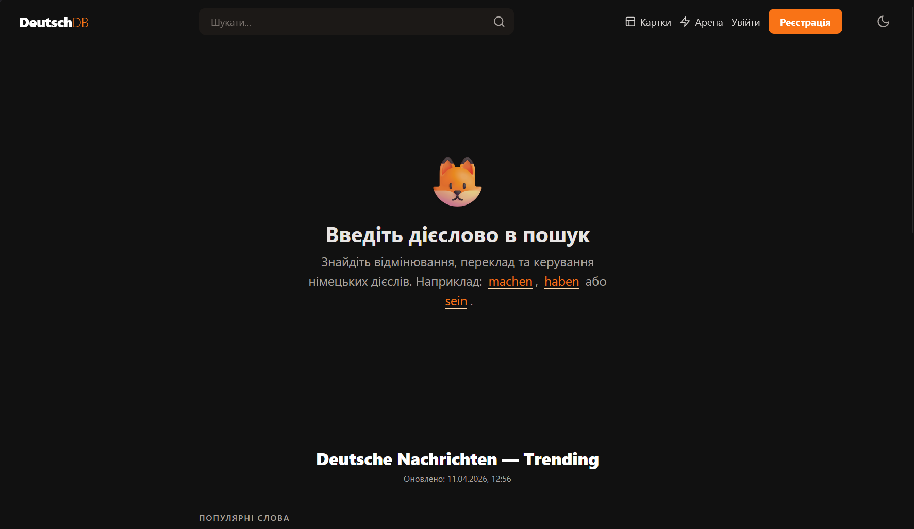
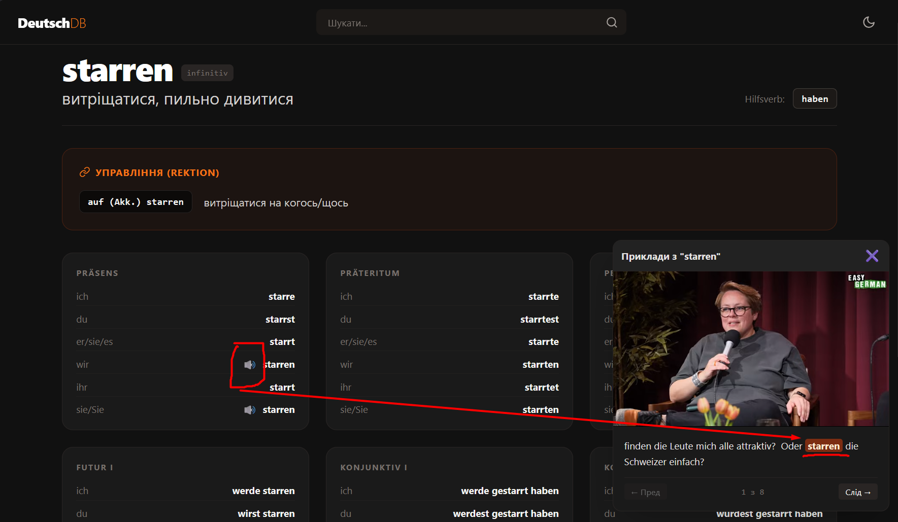
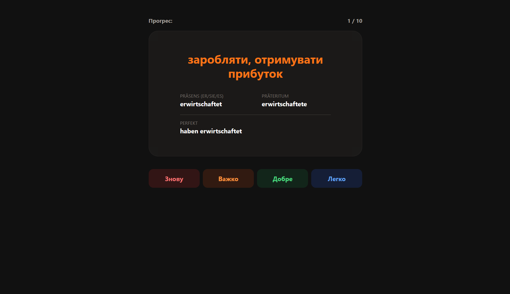
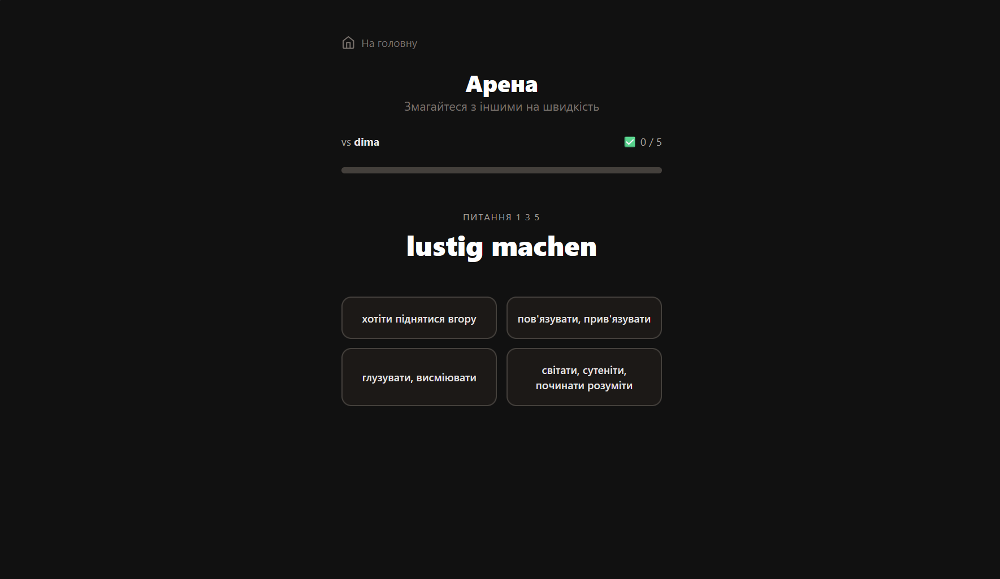
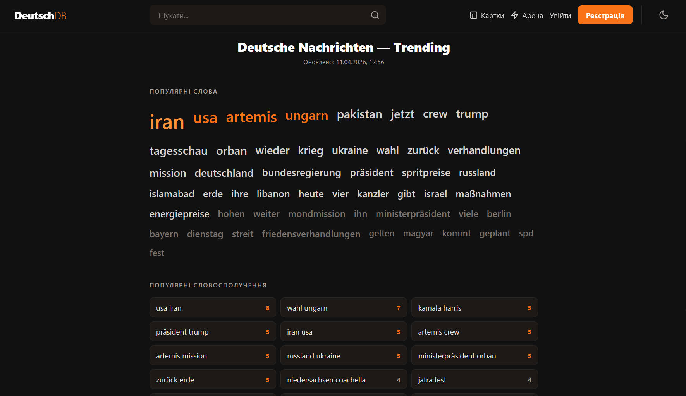

# **DeutschDB**

German word dictionary with useful features, that I didn't find all in one place in other apps. (You can see images at the end of the document)

---

### **Problem it solves:**

- Opportunity to hear the pronunciation from native speakers and not just AI generated audio (through the built-in youtube player)
- Translations not only words, but also versions with their prepositions (auf/nach/von...) (I personally had to use chatGPT each time to do that)

---

### **Additional features:**

- ANKI cards to not just translate, but to learn the words
- Competitive with other players to have some fun
- The most popular words from media to stay up to date
- Of course all tenses and forms of the word

---

### **Currently available translation languages:**

- ukrainian

---

    <h3>Main page</h3>

    <h3>Word example</h3>

    <h3>ANKI card</h3>

    <h3>Competitive arena</h3>

    <h3>Tranding words</h3>

